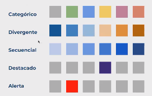

#### Dashboard design / El diseño del dashboard 
EN

1. What is the objective ?
2. Who is it aimed at? Depending on the answer it will have more or less detail.
3. What are the best char to choose based on the objective ?
4. Priorize simplification, hierarchy and aligment.

Remember that dashboards are as much about the data as 
they are about the charts, so take into account:
- Comparability or context.
- Temporality.
- Filters.

For excellent results, pay attention to composition, 
typography and colors.

ES

1. ¿Cuál es el objetivo?
2. ¿Para quién está dirigido? Según la respuesta tendrá más o menos detalles
3. ¿Cuáles son los mejores gráficos a elegir según el objetivo?
4. Dar prioridad a la simplicidad, jerarquización y alineación.

Recordar que el o los dashboards tienen tanto que ver con los datos 
como con los gráficos, para ello tomar en cuenta:
- La comparabilidad o contextualidad.
- La temporalidad.
- Los filtros.

Para excelentes resultados, fijarse en la composición, tipografía y colores.

#### Steps for dashboard creation /Pasos para la creación del dashboard
EN
Steps for dashboard creation

1. What are the most important variables for the business or department?
> Ask the right questions, not based on the data I have

2. What is the hierarchy of those variables?
> - Narrative pyramid
> - Highlight the most important
> - Use tooltips for support

3. In what order should the data appear?
> - Visual flow
> - Navigation options

4. Correct charts - translates into making the user's work easier
5. Dashboard sketch
6. Typography and colors
Colors:
- Conventional color system
- Do not use a wide palette
- Be consistent

ES

1. ¿Cuáles son las variables más importantes para el negocio o departamento?
> Hacer las preguntas correctas, no hacerlas en función de los datos que tengo

2. ¿Cuál es la jerarquía de esas variables?
> - Pirámide narrativa
> - Destacar lo más importante
> - Apoyarse de las descripciones emergentes

3. ¿En qué orden deben aparecer los datos?
> - Recorrido visual
> - Opciones de navegación

4. Gráficos correctos - se traduce en facilitar el trabajo al usuario
5. Boceto del dashboard
6. Tipografía y colores
Colores:
- Sistema convencional de colores
- No usar amplia paleta
- Ser coherente

