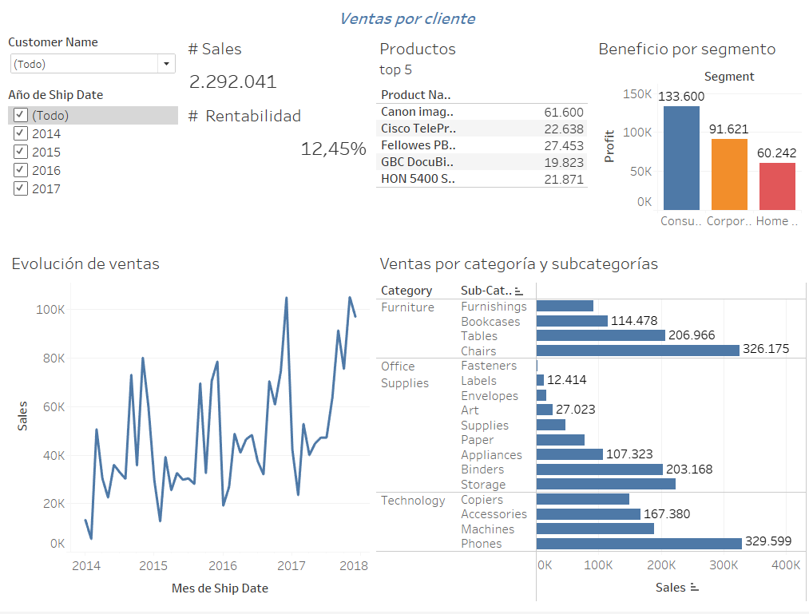
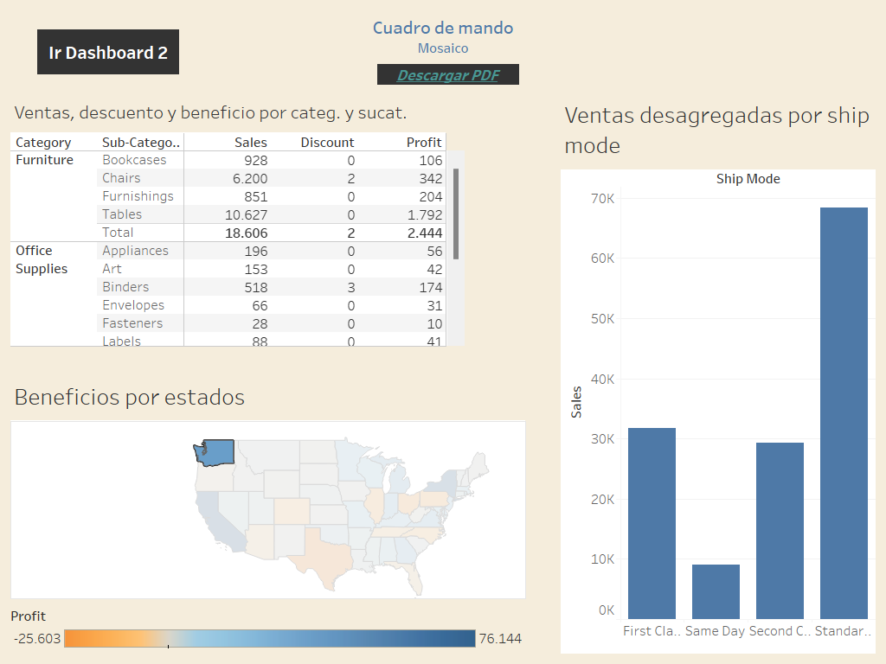
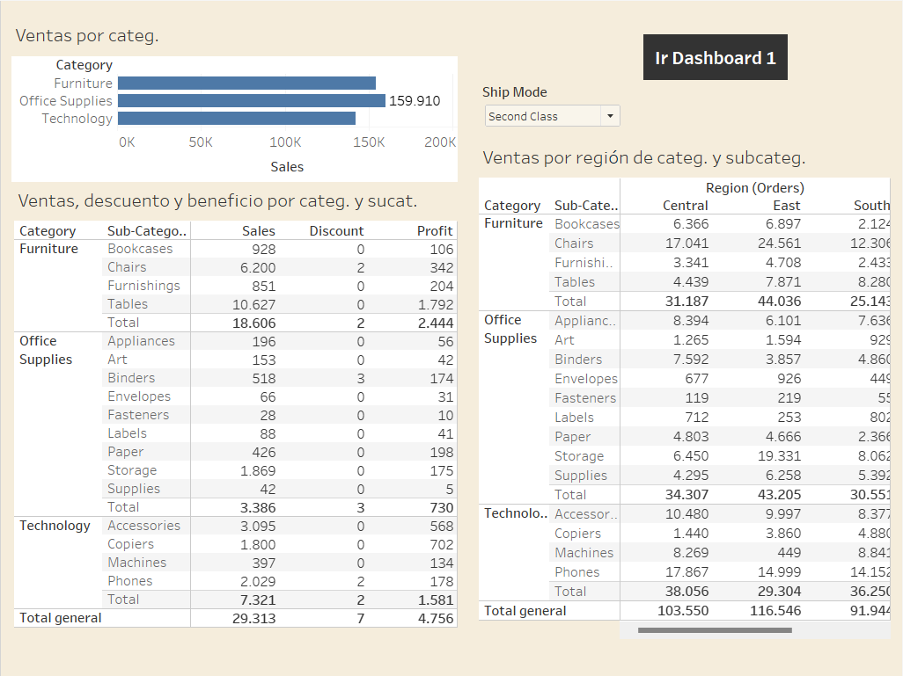

# tableau-superstore-dashboard
Interactive Tableau dashboard analyzing sales and profit  from the Sample Superstore dataset, covering context  filters, date parameters and multi-sheet visualizations.

## Description / Descripción

EN

Practice projects build with tableu Desktop using the sample superstore dataset. Include interactive filters, context filters, dat range sliders, parameter controls, ande multi-sheet dashboards analyzing sales and profit across regions, categories and customer segments.

ES

Proyecto de práctica desarrollado con Tableau Desktop 
usando el dataset Sample Superstore. Incluye filtros 
interactivos, filtros de contexto, sliders de rango 
de fechas, controles de parámetros y dashboards 
multi-hoja para analizar ventas y beneficios por 
región, categoría y segmento.

## Session 1 - Sales Dashboard

EN / ES

- Sales disaggregated by region and category / Ventas desagregadas por región y categoría
- Profit by region with target line / Beneficio por región con línea de target / 
- Sales by subcategories highlighting Binders / Ventas por subcategorías resaltando Binders 
- Average monthly sales - Seasonality analysis/ Promedio de ventas por meses - Análisis de estacionalidad 
- Profit by category and region / Beneficio por categoría y región
- Profitability by category and subcategory /Rentabilidad por categoría y subcategoría
- Sales percentage by category and segment / Porcentaje de ventas por categoría y segmento
-  Sales evolution with trend / Evolución de ventas con tendencia
-  Annual Sales and Cost Comparison / Comparativa de Ventas y Costo anual
- Totals and subtotals table / Tabla de totales y subtotales

### Exercise 1 / Ejercicio 1
---

EN
- Build a customer sales dashboard

As a user, I want to be able to choose one or all customers when visualizing the dashboard, and observe the charts and insights of the selected customer.

The dashboard must include:
* Filters: Customers and Years
* Insights: #Total Sales and #Profit Percentage
* Charts:
    - Sales Evolution - The year filter must not affect this chart
    - Sales disaggregated by category and subcategories
    - Profit by segment
* Table: Top 5 best-selling products for the selected 
customer or all customers

ES
- Realizar un dashboard de ventas por cliente

Yo como usuario, quiero que al visualizar el dashboard, pueda elegir uno o todos los clientes y observar las gráficas e insights del cliente seleccionado.

El dashboard debe tener:
* Filtros: Clientes y Años
* Insigts: #Total de ventas y  #Rentabilidad en porcentaje
* Gráficos:
    - Evolución de ventas - El frilto de año no debe afectar dicho gráfico
    - Ventas desagregadas por categoría y subcategorías
    - Beneficios por segmentos
* Tabla: Top 5 productos más vendidos al cliente 
seleccionado o de todos los clientes

### Exercise 1 - Resolution / Resolución
* Dashboard: Ventas por cliente
* File: `SuperStore_ventasXcliente.twb`

## Session 2 - Sales Dashboard / Dashboard de Ventas

### Part I / Parte I

EN / ES

* Sales, discount and profit by category and subcategory / Ventas, descuento y beneficio por categoría y subcategoría
* Grand totals and subtotals / Totales generales y subtotales
* Sales by region and category / Ventas por región y categoría
* Sales by state map / Mapa de ventas por estados
* Sales by state + Tooltip (chart + table) / Ventas por estados + Descripción emergente (gráfico + tabla)
* Sales disaggregated by ship mode / Ventas desagregadas por ship mode
* Dashboard: Sales - Mosaic / Dashboard: Ventas - Mosaico
* Dashboard: Sales - Floating / Dashboard: Ventas - Flotante
* Stories in Tableau / Historias en Tableau

### Part II / Parte II

#### Dashboard design / El diseño del dashboard
> 📖 My notes / Mis notas : [Dashboard Design Guide](DASHBOARD_DESIGN.md)

### Exercise 2 / Ejercicio 2
---

Analizar el tiempo medio de entrega (TME)

· Vamos a trabajar hasta el 31/12/2017
· Campo calculado: media de (fecha de entrega – fecha de pedido)

· TME del último mes
· TME del total del periodo global
· Evolución mensual del TME en todo el periodo, con línea de promedio
· TME por día de la semana
· Gráfico de barras TME por modo de envío con una línea de referencia de 3 días
· Grafico de barras TME por segmento, con Corporate de color distinto.
· Gráfico de barras TME por categoría, con ventana emergente con detalle de las subcategorías
· Mapa del TME entrega por estados. Color divergente rojo-verde, con el centro en 3,95
· Tabla de productos TOP 10 con los mejores TME
· Dashboard con
o   Filtro de fecha general que aplique a todo menos a TME actual
o   Filtro de modo de envío que afecte a todo menos a TME global
